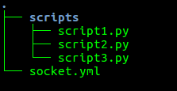

# Syncano Custom Sockets

## YAML file structure (socket.yml)

    name: my_integration
    description: Example integration  
    author:
      name: Sebastian
      email: sebastian@syncano.com
    config:
      constants:
        secret_key: value
      prompt:
        user_key:
          type: string
          description: A Syncano user key
    icon:
      name: icon_name
      color: red
    endpoints:
      my_endpoint_1:
        script: script_endpoint_1
    
      my_endpoint_2:
        POST:
          script: script_endpoint_2
        GET:
          script: script_endpoint_3
    
    dependencies:
      scripts:
        script_endpoint_1:
          runtime_name: python_library_v5.0
          file: scripts/script1.py
    
        script_endpoint_2:
          runtime_name: python_library_v5.0
          file: scripts/script2.py
    
        script_endpoint_3:
          runtime_name: python_library_v5.0
          file: scripts/script3.py

      classes:
        country:
          schema:
            - name: name
              type: string
            - name: topLevelDomain
              type: string
            - name: capital
              type: string
            - name: alpha2Code
              type: string
            - name: alpha3Code
              type: string

### YAML file structure explanation

* `name` is the name of your new Custom Socket - this should be unique;
* `description` is a description of your Custom Socket - it allows you to easily identify what your custom socket does;
* `author` is metadata information about the Custom Socket author; Under the hood: all fields that are not 
    * `name`, 
    * `description`, 
    * `endpoints`, 
    * `dependencies` 
    * can be found in `metadata` field on Custom Socket in Syncano Dasboard.
* `icon` is metadata information about your Custom Socket - it stores the icon name used and its color (used in Syncano Dashboard)
* `endpoints` - definition of the endpoints in a Custom Socket; Currently supported endpoints can be only of `script` type.
* `config` - stores the metadata about custom socket configuration; constants are config variables that are passed one-to-one
  from yaml file definitions; the `prompt` config section - this variables will be requested from user during installation.

    Consider this example:
    
        my_endpoint_1:
          script: script_endpoint_1

    In the YAML snippet:
    * `my_endpoint_1` is an endpoint name - it will be used in the url path; 
        * `script` is a type of the endpoint; 
        * `script_endpoint_1` is the dependency name which will be called when endpoint 
    `my_endpoint_1` will be requested; 
    
    In the example above we didn't specify HTTP method - so no matter what HTTP method 
    is used to call `my_endpoint_1` (can be PATCH, POST, GET, etc.), script endpoint `script_endpoint_1` will be called;
    
    Consider yet another example:
    
        my_endpoint_2:
          POST:
            script: script_endpoint_2
          GET:
            script: script_endpoint_3

    In the above YAML snippet:
    * `my_endpoint_2` is an endpoint name. 
    * GET, POST - define HTTP method type used to call our endpoint
    
    The difference is that we now define what happens for the different HTTP methods. When the GET HTTP method is used, 
    `script_endpoint_3` script endpoint will be run. When the POST HTTP method is used - `script_endpoint_2` endpoint will be executed. 
    
    Currently Script Endpoints and Classes are supported, which run scripts under the hood.  
    We are working on adding more options!

* `dependencies` - the definition of your Custom Socket dependencies. They define all dependency objects
which will be called when the endpoint is requested. 

    Consider the example:
    
        dependencies:
         scripts:
          script_endpoint_1:
           runtime_name: python_library_v5.0
           file: scripts/script1.py

    Above YAML snippet defines four dependencies (three of type `script` and one of type `class`):
    * `script` - type of the dependency (defined using `scripts` keyword). 
        * `script_endpoint_1` - name of the dependency; it's an important element, because that's the place where you connect a dependency to an endpoint. 
            * `runtime_name` is name of the runtime used in a script; 
            * `file` stores the source code that will be executed.
    
    It should be noted that when defining Custom Scripts, we suggest following some basic directory structure- for
    better work organization. We recommend storing scripts under the `scripts` directory - this is why the filename 
    is a relative path: `scripts/script1.py`. Of course your can also follow your own rules,  e.g. by using a flat file structure.
    
    The class dependency looks as follows:
        
        classes:
          country:
            schema:
              - name: name
                type: string
              - name: topLevelDomain
                type: string
              - name: capital
                type: string
              - name: alpha2Code
                type: string
              - name: alpha3Code
                type: string
                
    This simple mean that Custom Socket requires a class `country` to work properly. Under the hood - Syncano Platform
    will check if this class exists (if not - create it) and ensure that all required files defined in `schema` are present.
        

## Custom Socket directory structure

Below is a sample Custom Socket structure for the above YAML definition:

`socket.yml` file stores the YAML definition mentioned above; `scripts` directory stores all scripts source
code used in `script` dependency type. 

## Custom Socket examples

* ['HelloWorld' example](examples/hello_world.md)
* [Advanced example: provide title here](examples/advanced.md)
