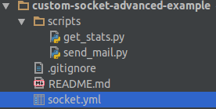

# Advanced Custom Socket example
 
## Abstract

This in an advanced example of Syncano Custom Sockets, showing an integration with Mailgun (https://mailgun.com/). 

We will use Mailgun's sandbox environment, which allows sending up to 300 emails per day - it should be more than enough for testing. 

We will implement two endpoints inside the Custom Socket - one for sending emails, and a second one to obtain some basic statistics.

## Repository link

The whole example can be found under: [Syncano/custom-socket-advanced-example](https://github.com/Syncano/custom-socket-advanced-example).
It can be installed to your Syncano instance using the `install from url` functionality in the CLI. The url is: 

https://github.com/Syncano/custom-socket-advanced-example/blob/master/socket.yml

## Prerequisites

* Syncano Account - [Create one here](https://www.syncano.io/). 
* GIT - If you want to edit files locally, clone our repository using: 

```bash
git clone git@github.com:Syncano/custom-socket-advanced-example.git`
```

* Syncano [CLI tool](https://pypi.python.org/pypi/syncano-cli/0.5) in version 0.5 or higher.

    > Note:
    > It is nice to use virtualenv to separate your tools: `sudo pip install virtualenv`
    > Then create virtual env: `virtualenv cli` and active it: `source cli/bin/activate`
    > Install Syncano CLI: `pip install syncano_cli>=0.5`

* Your favorite text editor.

## YML definition

    name: mailgun_integration
    description: An advanced example of Custom Socket - mailgun integration.
    author:
      name: Info at Syncano
      email: info@syncano.com
    endpoints:
      send_mail:
        POST:
          script: send_mail
    
      get_stats:
        GET:
          script: get_stats
    
    dependencies:
      scripts:
        send_mail:
          runtime_name: python_library_v5.0
          file: scripts/send_mail.py
    
        get_stats:
          runtime_name: python_library_v5.0
          file: scripts/get_stats.py

Above YAML file defines one Custom Socket with two endpoints: 
* `send_mail` for sending emails, it's run on POST HTTP method call; we want to pass some basic information about who it should be sent to, what subject should be used and what text should be in the email itself;
* `get_stats` - second endpoint is for obtaining basic stats from Mailgun service.

There are also two `script` dependencies defined.

## Scripts definition

### scripts/send_mail.py

    import requests
    import json
    
    api_key = CONFIG.get('mailgun_api_key')
    
    to_email = ARGS.get('to_email')
    subject = ARGS.get('subject')
    email_body = ARGS.get('email_body')
    
    response = requests.post(
        "https://api.mailgun.net/v3/sandboxa8ccfb01296d4b19bace47fb8102d130.mailgun.org/messages",
        auth=("api", api_key),
        data={
            "from": "Mailgun Sandbox <postmaster@sandboxa8ccfb01296d4b19bace47fb8102d130.mailgun.org>",
            "to": to_email,
            "subject": subject,
            "text": email_body
        }
    )
    
    if response.status_code == 200:
        success_content = json.dumps(
            {
                'status_code': 200,
                'info': u'Mail successfully sent to {}'.format(to_email)
            }
        )
        set_response(HttpResponse(status_code=200, content=success_content, content_type='application/json'))
    else:
        fail_content = json.dumps(
            {
                'status_code': response.status_code,
                'info': response.text
            }
        )
        set_response(HttpResponse(status_code=400, content=fail_content, content_type='application/json'))

Script above will send a request to Mailgun service - and this service will send an email to a user.
It's worth noting the `CONFIG` variable - it's an Instance global config dictionary/map - you can define its content inside
Syncano Dasboard under `Global Config` menu on the left, or using Syncano Libraries - more about it can be found 
[in our docs](http://docs.syncano.io/docs/snippets-scripts#section-global-config-dictionary) or using a CLI:
`syncano config add mailgun_api_key 99xx11`

### scripts/get_stats.py

    import requests

    api_key = CONFIG.get('mailgun_api_key')
    
    response = requests.get(
        "https://api.mailgun.net/v3/sandboxa8ccfb01296d4b19bace47fb8102d130.mailgun.org/stats/total",
        auth=("api", api_key),
        params={
            "event": ["accepted", "delivered", "failed"],
            "duration": "1m"}
    )
    
    if response.status_code == 200:
        set_response(HttpResponse(status_code=200, content=response.text, content_type='application/json'))
    else:
        set_response(HttpResponse(status_code=400, content=response.text, content_type='application/json'))

Above script will work as a proxy to the Mailgun service - will send a request about stats and pass the result as
a response.


## Custom Socket directory structure

The directory structure in my favourite editor looks like this:



or in tree format:
    
    .
    ├── scripts
    │   ├── get_stats.py
    │   └── send_mail.py
    └── socket.yml


## Putting everything together

### Steps:

1. Assuming that you have Syncano CLI installed, log in using: `syncano login --instance-name your-instance-name`
    In my case it is:
    
        syncano login --instance-name patient-resonance-4283

    Next you will see a prompt for `username` and `password`; provide both and confirm with `enter`.

2. There are two ways of installing a Custom Socket - one is using your local files and the second one is by using a URL.

    To install the Custom Socket from a URL do:
    
        syncano sockets install https://raw.githubusercontent.com/Syncano/custom-socket-advanced-example/master/socket.yml --name mailgun_integration

    In such scenario - you do not even need to clone the repository to your local machine. The `--name` parameter and name here are needed - because under the hood, empty Custom Socket is created - and code fetching from repository is done asynchronously in the second step.
    
    To install Custom Socket from local files do:
    
        syncano sockets install <path_to_files>

    In my case it is:
    
        syncano sockets install ../syncano_scripts/repos/custom-socket-advanced-example/
        
3. Try a newly created Custom Socket:

    To list Custom Sockets, do:
    
        syncano sockets list

    In the output you should find:
    
        - socket:
            info: ''
            name: mailgun_integration
            status: ok

    This means that Custom Socket `mailgun_integration` was created successfuly - the status is `ok`. In any other case you will see an `error` and detailed information in `info` about what went wrong.
    
    Now, list all defined endpoints:
    
        syncano sockets list endpoints

    In the output you should find:
    
        - endpoint:
            methods:
            - GET
            name: mailgun_integration/get_stats
            path: /v1.1/instances/patient-resonance-4283/endpoints/sockets/mailgun_integration/get_stats/
        - endpoint:
            methods:
            - POST
            name: mailgun_integration/send_mail
            path: /v1.1/instances/patient-resonance-4283/endpoints/sockets/mailgun_integration/send_mail/

4. Before you run an endpoint - be sure that you have Mailgun `api_key` inside your Instance Global Config. See the 
`send_mail.py` description for more details. My config looks like this:

        {"mailgun_api_key": "key-xxxxxxxxxxxxxxxxxxxxxxxxxxxxxxxx"}

    Of course you need to replace `key-xxxxxxxxxxxxxxxxxxxxxxxxxxxxxxxx` with your Mailgun API Key.

    You can use CLI to add this config variable to your instance:
 
        syncano config add mailgun_api_key key-xxxxxxxxxxxxxxxxxxxxxxxxxxxxxxxx

5. Run the endpoint defined in your Custom Socket:

    First, run the stats endpoint - it's easier, as it is a simple GET request without any arguments required.
    
        syncano sockets run mailgun_integration/get_stats

    In the output you should see something like this (probably not formatted):
    
        {
            "stats": [
                {
                    "delivered": {
                        "smtp": 5, 
                        "total": 5, 
                        "http": 0
                    }, 
                    "accepted": {
                        "outgoing": 5, 
                        "total": 5, 
                        "incoming": 0
                    }, 
                    "time": "Mon, 01 Aug 2016 00:00:00 UTC", 
                    "failed": {
                        "permanent": {
                            "suppress-complaint": 0, 
                            "suppress-bounce": 0, 
                            "total": 0, 
                            "bounce": 0, 
                            "suppress-unsubscribe": 0
                        }, 
                        "temporary": {
                            "espblock": 0
                        }
                    }
                }
            ], 
            "end": "Mon, 01 Aug 2016 00:00:00 UTC", 
            "resolution": "month", 
            "start": "Mon, 01 Aug 2016 00:00:00 UTC"
        }

    Above response is one-to-one to the response provided by Mailgun.
    
    Now let's send an e-mail!
    
    Run:
    
        syncano sockets run mailgun_integration/send_mail POST --data '{"subject": "CustomSocket MailGun test", "to_email": "FirstName LastName <your_email>", "email_body": "So nice to create Custom Sockets!"}'

    Do not forget to change e-mail address in JSON data.
    
    It should return:
    
        {
            u'info': u'Mail successfully sent to {to_email_value}', 
            u'status_code': 200
        }
        
    You can now call stats again and see if anything changed. 

6. To delete mailgun Custom Socket do:

        syncano sockets delete mailgun_integration

## Summary

Hope this was helpful! If you have any question or issues, do no hesitate to contact me directly: sebastian.opalczynski@syncano.com
I am also available on the [Syncano Slack community](http://syncano-community.github.io/slack-invite/). See you there!
