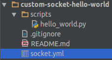
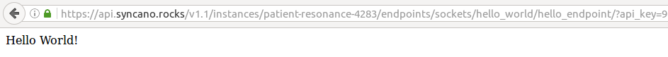

# HelloWorld example

## Abstract

In this example the simple Custom Socket will be created. The idea is to create an endpoint which will return
a `Hello world` message. 

## Repository link

The whole example can be found under: [Syncano/custom-socket-hello-world](https://github.com/Syncano/custom-socket-hello-world)
This can be installed in Syncano instance using the install from url functionality in CLI. The url is: url here

## Prerequisites

1. Syncano Account - Create one [here](https://www.syncano.io/). 
2. GIT - for repository clone: `git clone git@github.com:Syncano/custom-socket-hello-world.git`. If you want to edit
    files locally.
3. Syncano [CLI tool](https://pypi.python.org/pypi/syncano-cli/0.5) in version 0.5 or higher.

    > Note:
    > It is nice to use virtualenv to separate your tools: `sudo pip install virtualenv`
    > Then create virtual env: `virtualenv cli` and active it: `source cli/bin/activate`
    > Install Syncano CLI: `pip install syncano_cli>=0.5`

4. Your favourite text editor.
  
## YML definition

    name: hello_world
    author:
      name: Info
      email: info@synano.com
    description: Hello World example
    endpoints:
      hello_endpoint:
        script: hello_world
    
    dependencies:
      scripts:
        hello_world:
          runtime_name: python_library_v5.0
          file: scripts/hello_world.py

The above YAML definition will store definition of the new Custom Socket with name `hello_world`. It defines one endpoint:
`hello_endpoint` with one dependency: `hello_world` script. In my favourite editor the project look as follows:

## Scripts definition

The script (`scripts/hello_world.py`) consist of a few lines:

    content = """
    <!DOCTYPE html>
    <html>
        <head>
            <title>Hello world!</title>
        </head>
    
        <body>
            Hello World!
        </body>
    </html>
    """
    
    set_response(HttpResponse(status_code=200, content=content, content_type='text/html'))

The above code executed in Syncano will return a valid html response with `Hellow World!` message inside. 
The `set_response` is a function which allow to return custom response from the script. 

## Custom Socket directory structure

As can be seen in the example above the basic structure of Custom Socket is:

    .
    ├── scripts
    │   └── hello_world.py
    └── socket.yml

The `socket.yml` file stores YAML definition of the Custom Socket, and under `scripts` directory there a definition
of Custom Socket dependencies (currently of type `script`).

## Pulling everything together

### Steps:

1. Assuming that you have Syncano CLI installed, do a login: `syncano login --instance-name your-instance-name`
    In my case it is:
    
        syncano login --instance-name patient-resonance-4283

    Next you will see the prompt for `username` and `password`; Provide it. 
    
2. There are two ways of installing Custom Socket - one is using your local files and the second is to use a url.

    To install Custom Socket from url do:
    
        syncano sockets install https://raw.githubusercontent.com/Syncano/custom-socket-hello-world/master/socket.yml --name hello_world

    In such scenario - you do not need even clone the repository to your local machine. The name here is needed - because
    under the hood empty Custom Socket is created - and code fetch from repository is done asynchronously in second
    step.
    
    To install Custom Socket from local files do:
    
        syncano sockets install <path_to_files>

    In my case it is:
    
        syncano sockets install ../syncano_scripts/repos/custom-socket-hello-world/

    So you need to point to the parent directory of your `socket.yml` definition.
     
3. Try a newly created Custom Socket:

    To list a Custom Sockets, do:
    
        syncano sockets list

    In the output you should find:
    
        - socket:
            info: ''
            name: hello_world
            status: ok

    This mean that Custom Socket hello_world was created successfuly - the status is `ok`. In any other case you will see
    here and `error` and detailed information in `info` - what was wrong.
    
    Now list the defined endpoints:
    
        syncano sockets list endpoints

    In the output you should find:
    
        - endpoint:
            methods:
            - POST
            - PUT
            - PATCH
            - GET
            - DELETE
            name: hello_world/hello_endpoint
            path: /v1.1/instances/your-instance-name/endpoints/sockets/hello_world/hello_endpoint/

4. Run the endpoint defined in Custom Socket:

        syncano sockets run hello_world/hello_endpoint

    You should see in the output raw html file:
    
        <!DOCTYPE html>
        <html>
            <head>
                <title>Hello world!</title>
            </head>
        
            <body>
                Hello World!
            </body>   
        </html>

    Lets see if output can be seen in the browser:
    Go to: `https://api.syncano.io/v1.1/instances/your-instance-name/endpoints/sockets/hello_world/hello_endpoint/?api_key=your_api_key`
    We defined the endpoint to handle GET http method. 
    
    In my case:
    
    

5. To delete Custom Socket do:

        syncano sockets delete hello_world

## Summary

Hope this will help. If you have any question or problems do no hesitate to contact me: sebastian.opalczynski@syncano.com
Also I am available on the Syncano slack community: http://syncano-community.github.io/slack-invite/
